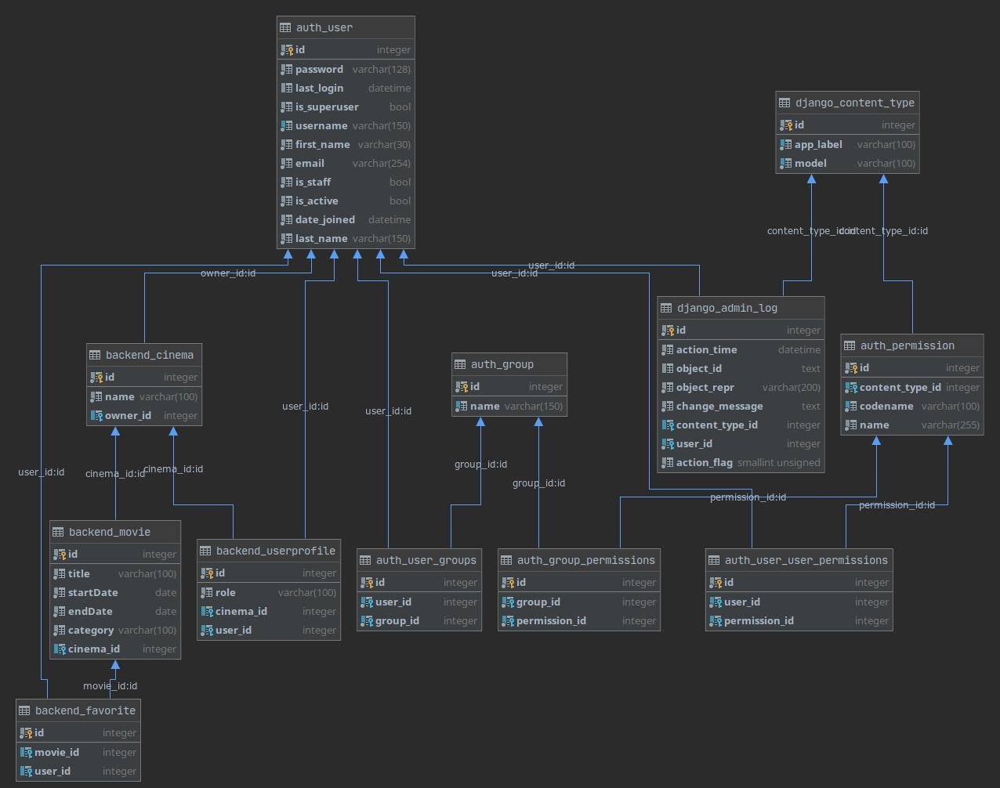

# Cinema

## PROJECT INFO
Στο δικό μου σενάριο εφαρμογής υπάρχει μόνο ένας admin και πολλοί users και owners. 

Η ανάπτυξη της εφαρμογής έχει γίνει με δυναμικό frontend μέσω vue js και axios (αντι για ajax). Τα components του
 frontend που θα θελήσετε να δείτε βρίσκονται στα path 'frontend/src/components' , 'frontend/src/router', 'frontend/src/views'

## FRAMEWORKS
#### BACKEND
 * ***Django  python***
#### FRONTEND
 * ***Vue js***
 * ***Material Design Bootstrap***
 
## COMPONENTS
 Μια σύντομη αναφορά στα κυριότερα βάσει των ζητουμένων
### ./views/Auth/Login.vue
Είναι η πρώτη σελίδα που εμφανίζεται, εκεί γίνεται η είσοδος του χρήστη με τα credentials που 
δίνονται παρακάτω. Κατά την είσοδο γίνεται έλεγχος ρόλου του χρήστη και γίνεται φόρτωση του κατάλληλου router js απο το 
'frontend/src/router'

### ./views/Auth/Register.vue
Στο κάτω μέρος του Login card βρίσκεται ένας σύνδεσμος ('Εγγραφή) για να οδηγηθεί ο χρήστης στην σελίδα της νέας εγγραφής.
Κατά την επιβεβαίωση ή ακύρωση της εγγραφής ο χρήστης οδηγείται και πάλι στο Login page.

### ./views/Home/welcome.vue
Είναι η πρώτη σελίδα που θα δεί ένας χρήστης κατά την είσοδό του. Εκεί θα δούμε οτι υπάρχει ένα sideNav το οποίο περιέχει
 στο πάνω μέρος την εικόνα του χρήστη το Όνομά του και τον Ρόλο του. Απο κάτω υπάρχουν τα redirecting tabs τα οποία είναι
  διαφορετικά για κάθε χρήστη, ανάλογα τον ρόλο του.
   
### ./views/Admin/Administration.vue
Η σελίδα στην οποία μπείνει μόνο ο admin και απο εκεί μπορεί να διαγράψει έναν χρήστη, να του αλλάξει ρόλο και να τον 
ενεργοποιήσει/απενεργοποιήσει. Όταν γίνεται αλλαγή ρόλου ενός owner σε user τότε αυτομάτως διαγράφονται και οι ταινίες 
και το σινεμά αυτού του χρήστη απο την βάση δεδομένων. Αντίστοιχα όταν ένας user γίνεται owner ζητείται να γίνει εισαγωγή
του ονόματος του cinema για να γίνει και η αντίστοιχη δημιουργία στην βάση.

### ./views/Owner/Owner.vue
Η σελίδα διαχείρισης των ταινιών ενός owner, απο εκεί διαγράφει, προσθέτει και αλλάζει στοιχεία των υπαρχόντων ταινιών του.

### ./views/User/Movies.vue
Σε αυτή την σελίδα έχουν πρόσβαση όλοι οι 'users' στη οποία βλέπουν όλες τις καταχωρημένες, στην βάση, ταινίες. Έχουν την
 δυνατότητα να φιλτράρουν αυτές που εμφανίζονται σύμφωνα με τον τίτλο, την κατηγορία, τον κινηματογράφο και την ημερομηνία
  προβολής. Τα φίλτρα αυτά μπορούν να εφαρμοστούν ταυτόχρονα. Επιπλέον στο αριστερό μέρος του πίνακα εμφανίζεται ένα κουμπί
   σε σχήμα αστεριού το οποίο όταν η ταινία βρίσκεται στα αγαπημένα είναι κίτρινο, διαφορετικά είναι άσπρο. Το κουμπί 
    είναι clickable και κατά το πάτημα γίνεται η αντίστοιχη διαδικασία, αφαίρεση ή προσθήκη στα αγαπημένα.  

### ./views/User/Favorites.vue
Τέλος, έχουμε την σελίδα των αγαπημένων ταινιών του κάθε χρήστη, που φαίνονται όλες οι ταίνιες που έχει προσθέσει σε αυτή 
την κατηγορία. Απο εκεί μπορεί μόνο να δει τις ταινίες σε μορφή πίνακα και να αφαιρέσει όσες και όποιες εκείνος επιθυμεί.

### ./components/Structure/Table.vue
Περιέχει ένα customizable πίνακα που υλοποιήσα, και παίρνει σαν props τα φίλτρα, τα κουμπία που θέλουμε σε κάθε row,
 τα κουμπιά που φαίνονται στο table header, τα δεδομένα του πίνακα που θέλουμε να προβάλουμε, καθώς επίσης και αν η 
 κάθε σειρά του πίνακα θα είναι clickable.

## PROJECT SETUP

```bash
docker-compose up --build
```
## USEFUL LINKS
| URL      | INFO      
| :------------- |:-------------
| http://localhost                  | Application      
| http://localhost:8000/admin/      | Admin page (u:master p:mousakas)      
| http://localhost:8000/api/        | api (Needs login to admin page as a first step)      
    
## CREDENTIALS

| USERNAME      | PASSWORD      |  ROLE
| :------------- |:-------------|:-------------
| user1         | mousakas      | User
| user2         | mousakas      | User
| owner1        | mousakas      | Owner
| owner2        | mousakas      | Owner
| admin         | mousakas      | Admin
    
## DATABASE SCHEMA

